<h1 align="center">Cortex</h1>
<p align="center"><strong>Own your AI memory. Take it everywhere.</strong></p>

<p align="center">
  <a href="https://pypi.org/project/cortex-identity/"></a>
  <a href="https://pypi.org/project/cortex-identity/"></a>
  <a href="https://github.com/Junebugg1214/Cortex-AI/blob/main/LICENSE"></a>
  <a href="https://github.com/Junebugg1214/Cortex-AI/stargazers"></a>
</p>

<p align="center">
  
</p>

---

**Your ChatGPT knows you. Now Claude does too.**

Cortex extracts your context from ChatGPT, Claude, Gemini, Perplexity, and coding tools (Claude Code, Cursor, Copilot) — builds a portable knowledge graph you own — and pushes it to any platform. Cryptographically signed. Version controlled. Zero dependencies.

## Quick Start

```bash
pip install cortex-identity

# Migrate ChatGPT → Claude in one command
cortex chatgpt-export.zip --to claude -o ./output

# See what it extracted
cortex stats output/context.json

# Visualize your knowledge graph
cortex viz output/context.json --output graph.html
```

## What Makes This Different

| | Cortex | Mem0 | Letta | ChatGPT Memory | Claude Memory |
|---|:-:|:-:|:-:|:-:|:-:|
| **You own it** | Yes | No | No | No | No |
| **Portable** | Yes | No | No | No | No |
| **Knowledge graph** | Yes | Partial | No | No | No |
| **Temporal tracking** | Yes | No | No | No | No |
| **Works offline** | Yes | No | No | No | No |
| **Zero dependencies** | Yes | No | No | N/A | N/A |

> Mem0, Letta, and built-in AI memories are **agent memory** — owned by the platform. Cortex is **your memory**, under **your control**.

## How It Works

```
Chat Exports (ChatGPT, Claude, Gemini, Perplexity)
  + Coding Sessions (Claude Code, Cursor, Copilot)
        |
   Extract ──→ Knowledge Graph ──→ Sign & Version ──→ Push Anywhere
```

Nodes are entities, not category items. "Python" is ONE node with tags `[technical_expertise, domain_knowledge]` — not duplicated across categories. Edges capture typed relationships: `Python --applied_in--> Healthcare`.

## Installation

```bash
pip install cortex-identity          # Core (zero dependencies)
pip install cortex-identity[crypto]  # + Ed25519 signatures
pip install cortex-identity[fast]    # + 10x faster graph layout
pip install cortex-identity[full]    # Everything
```

<details>
<summary><strong>Install from source</strong></summary>

```bash
git clone https://github.com/Junebugg1214/Cortex-AI.git
cd Cortex-AI
pip install -e .
```

Requires Python 3.10+ (macOS, Linux, Windows). No external packages required for core functionality.

</details>

---

## Features

<details>
<summary><strong>Knowledge Graph Engine</strong></summary>

### Graph Foundation

Everything is nodes and edges. Nodes have tags (not fixed categories), confidence scores, temporal metadata, and extensible properties. The graph is backward compatible — v4 flat-category JSON converts losslessly.

```bash
cortex query context.json --node "Python"
cortex query context.json --neighbors "Python"
cortex stats context.json
```

### Smart Edges

Automatic relationship discovery:

- **Pattern rules** — `technical_expertise` + `active_priorities` = `used_in` edge
- **Co-occurrence** — entities appearing together in messages get linked (PMI for large datasets, frequency thresholds for small)
- **Centrality** — identifies your most important nodes (degree centrality, PageRank for 200+ nodes)
- **Graph-aware dedup** — merges near-duplicates using 70% text similarity + 30% neighbor overlap

### Query + Intelligence

```bash
cortex query context.json --category technical_expertise
cortex query context.json --strongest 10
cortex query context.json --isolated
cortex query context.json --path "Python" "Mayo Clinic"
cortex query context.json --components
cortex gaps context.json
cortex digest context.json --previous last_week.json
```

</details>

<details>
<summary><strong>UPAI Protocol (Cryptographic Identity)</strong></summary>

Three capabilities:

- **Cryptographic signing** — SHA-256 integrity (always). Ed25519 signatures (with `pynacl`). Proves the graph is yours and untampered.
- **Selective disclosure** — Policies control what each platform sees. "Professional" shows job/skills. "Technical" shows your tech stack. "Minimal" shows almost nothing.
- **Version control** — Git-like commits for your identity. Log, diff, checkout, rollback.

```bash
cortex identity --init --name "Your Name"
cortex commit context.json -m "Added June ChatGPT export"
cortex log
cortex identity --show
cortex sync context.json --to claude --policy professional -o ./output
```

**Built-in disclosure policies:**

| Policy | What's Shared | Min Confidence |
|--------|---------------|----------------|
| `full` | Everything | 0.0 |
| `professional` | Identity, work, skills, priorities | 0.6 |
| `technical` | Tech stack, domain knowledge, priorities | 0.5 |
| `minimal` | Identity, communication preferences only | 0.8 |

</details>

<details>
<summary><strong>Temporal Tracking & Contradictions</strong></summary>

Every extraction snapshots each node's state. Cortex tracks how your identity evolves, detects contradictions ("said X in January, not-X in March"), and computes drift scores across time windows.

```bash
cortex timeline context.json --format html
cortex contradictions context.json --severity 0.5
cortex drift context.json --compare previous.json
```

### Conflict Detection

```
Input: "I use Python daily" + "I don't use Python anymore"
Result: negation_conflict detected, resolution: prefer_negation (more recent)
```

### Typed Relationships

```
Input: "We partner with Mayo Clinic. Dr. Smith is my mentor."
Result: Mayo Clinic (partner), Dr. Smith (mentor)
```

Supported types: `partner`, `mentor`, `advisor`, `investor`, `client`, `competitor`

</details>

<details>
<summary><strong>Visualization & Dashboard</strong></summary>

```bash
cortex viz context.json --output graph.html          # Interactive HTML
cortex viz context.json --output graph.svg --format svg  # Static SVG
cortex dashboard context.json --port 8420            # Web dashboard
cortex watch ~/exports/ --graph context.json         # Auto-extract
cortex sync-schedule --config sync_config.json       # Scheduled sync
```

</details>

<details>
<summary><strong>Coding Tool Extraction</strong></summary>

Extract identity from what you *actually do*, not just what you say. Coding sessions reveal your real tech stack, tools, and workflow through behavior:

```bash
cortex extract-coding --discover -o coding_context.json
cortex extract-coding --discover --project chatbot-memory
cortex extract-coding --discover --merge context.json -o context.json
cortex extract-coding --discover --enrich --stats
```

| Signal | How | Example |
|--------|-----|---------|
| Languages | File extensions | Editing `.py` files -> Python |
| Frameworks | Config files | `package.json` -> Node.js |
| CLI tools | Bash commands | Running `pytest` -> Pytest |
| Projects | Working directory | `/home/user/myapp` -> myapp |
| Patterns | Tool sequence | Uses plan mode before coding |

**Project enrichment** (`--enrich`): Reads README, package manifests, and LICENSE files to extract project metadata. Detects CI/CD and Docker presence.

Currently supports **Claude Code** (JSONL transcripts). Cursor and Copilot parsers planned.

</details>

<details>
<summary><strong>Auto-Inject & Cross-Platform Context</strong></summary>

### Auto-Inject into Claude Code

Every new session automatically gets your Cortex identity injected:

```bash
cortex context-hook install context.json
cortex context-hook test
cortex context-export context.json --policy technical
```

### Cross-Platform Context Writer

Write persistent Cortex identity to every AI coding tool:

```bash
cortex context-write graph.json --platforms all --project ~/myproject
cortex context-write graph.json --platforms cursor copilot windsurf
cortex context-write graph.json --platforms all --dry-run
cortex context-write graph.json --platforms all --watch
```

| Platform | Config File | Scope |
|----------|------------|-------|
| Claude Code | `~/.claude/MEMORY.md` | Global |
| Claude Code (project) | `{project}/.claude/MEMORY.md` | Project |
| Cursor | `{project}/.cursor/rules/cortex.mdc` | Project |
| GitHub Copilot | `{project}/.github/copilot-instructions.md` | Project |
| Windsurf | `{project}/.windsurfrules` | Project |
| Gemini CLI | `{project}/GEMINI.md` | Project |

Uses `<!-- CORTEX:START -->` / `<!-- CORTEX:END -->` markers — your hand-written rules are never overwritten.

</details>

<details>
<summary><strong>Continuous Extraction</strong></summary>

Watch Claude Code sessions in real-time. Auto-extract behavioral signals as you code:

```bash
cortex extract-coding --watch -o coding_context.json
cortex extract-coding --watch -o ctx.json --context-refresh claude-code cursor copilot
cortex extract-coding --watch --project chatbot-memory -o ctx.json
cortex extract-coding --watch --interval 15 --settle 10 -o ctx.json
```

Polls for session changes, debounces active writes, and incrementally merges nodes.

</details>

<details>
<summary><strong>PII Redaction</strong></summary>

Strip sensitive data before extraction:

```bash
cortex chatgpt-export.zip --to claude --redact
cortex chatgpt-export.zip --to claude --redact --redact-patterns custom.json
```

Redacts: emails, phones, SSNs, credit cards, API keys, IP addresses, street addresses.

</details>

---

<details>
<summary><strong>Supported Platforms</strong></summary>

### Input (Extract From)

| Platform | File Type | Auto-Detected |
|----------|-----------|---------------|
| ChatGPT | `.zip` with `conversations.json` | Yes |
| Claude | `.json` with messages array | Yes |
| Claude Memories | `.json` array with `text` field | Yes |
| Gemini / AI Studio | `.json` with conversations/turns | Yes |
| Perplexity | `.json` with threads | Yes |
| API Logs | `.json` with requests array | Yes |
| JSONL | `.jsonl` (one message per line) | Yes |
| Claude Code | `.jsonl` session transcripts | Yes |
| Plain Text | `.txt`, `.md` | Yes |

### Output (Export To)

| Format | Output | Use Case |
|--------|--------|----------|
| Claude Preferences | `claude_preferences.txt` | Settings > Profile |
| Claude Memories | `claude_memories.json` | memory_user_edits |
| System Prompt | `system_prompt.txt` | Any LLM API |
| Notion Page | `notion_page.md` | Notion import |
| Notion Database | `notion_database.json` | Notion DB rows |
| Google Docs | `google_docs.html` | Google Docs paste |
| Summary | `summary.md` | Human overview |
| Full JSON | `full_export.json` | Lossless backup |

### Extraction Categories

Cortex extracts entities into 17 tag categories:

| Category | Examples |
|----------|----------|
| Identity | Name, credentials (MD, PhD) |
| Professional Context | Role, title, company |
| Business Context | Company, products, metrics |
| Active Priorities | Current projects, goals |
| Relationships | Partners, clients, collaborators |
| Technical Expertise | Languages, frameworks, tools |
| Domain Knowledge | Healthcare, finance, AI/ML |
| Market Context | Competitors, industry trends |
| Metrics | Revenue, users, timelines |
| Constraints | Budget, timeline, team size |
| Values | Principles, beliefs |
| Negations | What you explicitly avoid |
| User Preferences | Style and tool preferences |
| Communication Preferences | Response style preferences |
| Correction History | Self-corrections |
| Mentions | Catch-all for other entities |

</details>

<details>
<summary><strong>Full CLI Reference (24 commands)</strong></summary>

### Extract & Import

```bash
cortex <export> --to <platform> -o ./output    # One-step migrate
cortex extract <export> -o context.json         # Extract only
cortex import context.json --to <platform>      # Import only
cortex extract new.json --merge old.json -o merged.json  # Merge contexts
```

### Query & Intelligence

```bash
cortex query <graph> --node <label>             # Find node
cortex query <graph> --neighbors <label>        # Find neighbors
cortex query <graph> --category <tag>           # Filter by tag
cortex query <graph> --path <from> <to>         # Shortest path
cortex query <graph> --strongest <n>            # Top N nodes
cortex query <graph> --weakest <n>              # Bottom N nodes
cortex query <graph> --isolated                 # Unconnected nodes
cortex query <graph> --components               # Connected clusters
cortex gaps <graph>                             # Gap analysis
cortex digest <graph> --previous <old>          # Weekly digest
cortex stats <graph>                            # Graph statistics
```

### Identity & Sync

```bash
cortex identity --init --name <name>             # Create identity
cortex commit <graph> -m <message>               # Version commit
cortex log                                       # Version history
cortex identity --show                           # Show identity
cortex sync <graph> --to <platform> --policy <name>  # Push to platform
```

### Visualization & Flywheel

```bash
cortex viz <graph> --output graph.html          # Interactive HTML
cortex viz <graph> --output graph.svg --format svg  # Static SVG
cortex dashboard <graph> --port 8420            # Web dashboard
cortex watch <dir> --graph <graph>              # Auto-extract
cortex sync-schedule --config <config.json>     # Scheduled sync
```

### Coding Tool Extraction

```bash
cortex extract-coding <session.jsonl>           # From specific file
cortex extract-coding --discover                # Auto-find sessions
cortex extract-coding --discover -p <project>   # Filter by project
cortex extract-coding --discover -m <context>   # Merge with existing
cortex extract-coding --discover --stats        # Show session stats
cortex extract-coding --discover --enrich       # Enrich with project files
cortex extract-coding --watch -o ctx.json       # Watch mode (continuous)
cortex extract-coding --watch --context-refresh claude-code cursor  # Watch + auto-refresh
```

### Context Hook (Auto-Inject)

```bash
cortex context-hook install <graph> --policy technical  # Install hook
cortex context-hook uninstall                   # Remove hook
cortex context-hook test                        # Preview injection
cortex context-hook status                      # Check status
cortex context-export <graph> --policy technical  # One-shot export
```

### Cross-Platform Context Writer

```bash
cortex context-write <graph> --platforms all --project <dir>  # All platforms
cortex context-write <graph> --platforms cursor copilot       # Specific platforms
cortex context-write <graph> --platforms all --dry-run        # Preview
cortex context-write <graph> --platforms all --watch          # Auto-refresh
cortex context-write <graph> --platforms all --policy professional  # Policy override
```

### Temporal Analysis

```bash
cortex timeline <graph> --format html           # Timeline view
cortex contradictions <graph> --severity 0.5    # Find conflicts
cortex drift <graph> --compare previous.json    # Identity drift
```

</details>

<details>
<summary><strong>Architecture</strong></summary>

```
cortex-identity/                    # pip install cortex-identity
├── pyproject.toml                  # Package metadata + entry points
├── cortex/
│   ├── cli.py                  # CLI entry point (24 subcommands)
│   ├── extract_memory.py       # Extraction engine (~1400 LOC)
│   ├── import_memory.py        # Import/export engine (~1000 LOC)
│   ├── graph.py                # Node, Edge, CortexGraph (schema 6.0)
│   ├── compat.py               # v4 <-> v5 conversion
│   ├── temporal.py             # Snapshots, drift scoring
│   ├── contradictions.py       # Contradiction detection
│   ├── timeline.py             # Timeline views
│   ├── upai/
│   │   ├── identity.py         # UPAI identity, DID, Ed25519/HMAC signing
│   │   ├── disclosure.py       # Selective disclosure policies
│   │   └── versioning.py       # Git-like version control
│   ├── adapters.py             # Claude/SystemPrompt/Notion/GDocs adapters
│   ├── edge_extraction.py      # Pattern-based + proximity edge discovery
│   ├── cooccurrence.py         # PMI / frequency co-occurrence
│   ├── dedup.py                # Graph-aware deduplication
│   ├── centrality.py           # Degree centrality + PageRank
│   ├── query.py                # QueryEngine + graph algorithms
│   ├── intelligence.py         # Gap analysis + weekly digest
│   ├── coding.py               # Coding session behavioral extraction
│   ├── hooks.py                # Auto-inject context into Claude Code
│   ├── context.py              # Cross-platform context writer (6 platforms)
│   ├── continuous.py           # Real-time session watcher
│   ├── _hook.py                # cortex-hook entry point
│   ├── __main__.py             # python -m cortex support
│   ├── viz/                    # Visualization
│   ├── dashboard/              # Local web dashboard
│   └── sync/                   # File watcher + scheduled sync
├── migrate.py                  # Backward-compat stub → cortex.cli
├── cortex-hook.py              # Backward-compat stub → cortex._hook
└── tests/                      # 618 tests across 21 files
```

</details>

<details>
<summary><strong>Version History</strong></summary>

| Version | Milestone |
|---------|-----------|
| v1.0.0 | **First public release** — 24 CLI commands, knowledge graph, UPAI protocol, temporal tracking, coding extraction, cross-platform context, continuous extraction, visualization, dashboard. 618 tests. Zero required dependencies. |

<details>
<summary>Pre-release development history</summary>

| Internal | Milestone |
|----------|-----------|
| v6.4 (dev) | pip packaging, continuous extraction, production hardening |
| v6.3 (dev) | Cross-platform context writer |
| v6.2 (dev) | Auto-inject context |
| v6.1 (dev) | Coding tool extraction |
| v6.0 (dev) | Visualization, dashboard, file monitor, sync scheduler |
| v5.4 (dev) | Query engine, gap analysis, weekly digest |
| v5.3 (dev) | Smart edge extraction, co-occurrence, centrality, dedup |
| v5.2 (dev) | UPAI Protocol — cryptographic signing, selective disclosure, version control |
| v5.1 (dev) | Temporal snapshots, contradiction engine, drift scoring |
| v5.0 (dev) | Graph foundation — category-agnostic nodes, edges |
| v4.x (dev) | PII redaction, typed relationships, Notion/Google Docs, semantic dedup |

</details>

</details>

---

## License

MIT — See [LICENSE](LICENSE)

## Author

Created by [@Junebugg1214](https://github.com/Junebugg1214)
