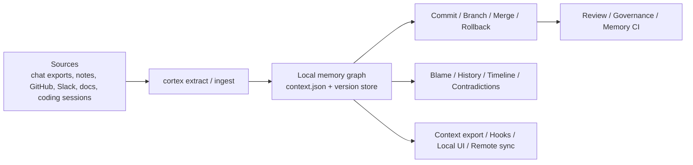

# Cortex

**Git for AI Memory.**

Cortex is a local-first toolkit for building, reviewing, governing, and syncing AI memory with the same kinds of primitives developers expect from source control:

- commit
- branch
- merge
- review
- rollback
- blame
- history
- remote push/pull
- governance

It turns exports, notes, docs, tickets, coding sessions, and manually curated context into a versioned memory graph you can inspect, diff, explain, and share without giving up control of the underlying files.

## Why This Exists

Most AI memory systems are opaque.

When an agent says something important, you usually cannot answer:

- Where did that claim come from?
- When was it true?
- What changed between versions?
- Which source introduced the bad memory?
- Can I roll it back without destroying history?
- Who is allowed to write or merge this memory?

Cortex is built to answer those questions directly.

## What Cortex Does

- Extracts memory from chat exports, notes, plain text, coding sessions, and normalized GitHub, Slack, and docs inputs
- Stores memory as a local graph you can query, diff, branch, merge, and roll back
- Tracks provenance so you can blame a claim to its source and inspect its receipt trail
- Detects contradictions, semantic drift, timeline changes, and temporal gaps
- Lets you retract memory by source instead of manually cleaning a graph
- Adds governance rules for who can read, write, branch, merge, roll back, push, or pull
- Syncs memory stores explicitly with remote push, pull, and fork semantics
- Exposes a small local web UI for review, blame, history, governance, and remotes
- Exposes local REST, SDK, and MCP tool-server surfaces without taking ownership of user storage
- Exports context for downstream tools and coding workflows

## Who It's For

- Developers building long-lived AI agents
- Teams that want auditable memory instead of opaque context blobs
- People who want portable AI identity and memory across tools
- Builders who need a local memory control plane, not another hosted SaaS

## Example Use Cases

- **Agent debugging**: explain why an agent believed `Project Atlas` was active, who introduced that claim, and what changed afterward
- **Memory CI**: compare `context.json` on a PR against `main` and fail only on contradictions or temporal gaps
- **Safe experimentation**: branch memory for a new persona, project mode, or imported source before merging it back
- **Bad import recovery**: retract everything that came from one bad export or roll back to a known-good memory state
- **Multi-agent collaboration**: push and pull memory branches between local stores with explicit governance and approval rules
- **Coding assistants with receipts**: export stable project context, inspect history, and keep assistant memory tied to real sources

## Mental Model



## 60-Second Demo

```bash
# Install Cortex
pip install "cortex-identity[full]"

# Build a memory graph from a source file
cortex extract chat-export.json -o context.json

# Save a versioned memory snapshot
cortex commit context.json -m "Import planning notes"

# Create a safe experimental memory branch
cortex branch experiment/planning-cleanup
cortex switch experiment/planning-cleanup

# Review changes before merging
cortex review context.json --against main --fail-on contradictions,temporal_gaps --format md

# Ask why a memory claim exists
cortex blame context.json --label "Project Atlas"

# Query what was true at a point in time
cortex query context.json --node "Project Atlas" --at 2026-03-15T00:00:00Z

# Open the local infrastructure console
cortex ui --context-file context.json
```

## Core Workflows

### 1. Build Memory from Real Inputs

```bash
cortex extract notes.json -o context.json
cortex ingest github issue.json -o context.json
cortex ingest slack ./slack-export -o context.json
cortex ingest docs ./docs -o context.json
```

### 2. Version AI Memory Like Code

```bash
cortex commit context.json -m "Import March planning notes"
cortex log
cortex diff <version-a> <version-b>
cortex checkout <version> -o restored.json
cortex rollback context.json --to <version>
```

### 3. Create Safe Branches for Experiments

```bash
cortex branch feature/project-atlas
cortex switch feature/project-atlas
cortex review context.json --against main
cortex merge main
```

### 4. Explain, Audit, and Retract

```bash
cortex blame context.json --label "PostgreSQL"
cortex history context.json --label "PostgreSQL"
cortex claim log --label "PostgreSQL"
cortex memory retract context.json --source planning-doc-v1
```

### 5. Govern and Sync Memory

```bash
cortex governance allow protect-main \
  --actor "agent/*" \
  --action write \
  --namespace main \
  --approval-below-confidence 0.75

cortex remote add origin /path/to/other/store
cortex remote push origin --branch main
cortex remote pull origin --branch main --into-branch remotes/origin/main
```

## Why Cortex Feels Different

Most memory tooling focuses on storage and retrieval.

Cortex focuses on **operability**:

- not just storing memory, but versioning it
- not just retrieving claims, but explaining them
- not just importing data, but retracting bad evidence
- not just sharing context, but governing who can change it
- not just diffing JSON, but surfacing semantic drift and contradiction risk

If Git gives developers confidence in code changes, Cortex is trying to do the same for AI memory changes.

## Local Infrastructure UI

Cortex ships with a small local web app for the operational side of memory:

- review results
- blame receipts
- claim history
- governance policies
- remote sync flows

Run it with:

```bash
cortex ui --context-file context.json
```

## MCP Server

Cortex can also run as a local MCP server over stdio for agent runtimes that want tool-based memory access while
keeping storage user-owned.

```bash
cortex mcp --store-dir .cortex
# or
cortex-mcp --store-dir .cortex --namespace team
```

The MCP surface maps onto the same object/query/version runtime as the REST API, including node, edge, claim,
query, branch, merge, blame, history, indexing, and prune tools.

## Memory CI

The repo includes [`.github/workflows/memory-review.yml`](.github/workflows/memory-review.yml), which can:

- compare a checked-in memory file against the base branch
- emit a Markdown review summary in GitHub Actions
- upload JSON and Markdown review artifacts
- fail only on gates you choose, such as `contradictions` and `temporal_gaps`

Local equivalent:

```bash
cortex review context.json --against main --fail-on contradictions,temporal_gaps --format md
cortex review context.json --against main --fail-on none --format json
```

## More Detailed Product Walkthrough

For the full Git-for-AI-Memory feature walkthrough, see [GIT_FOR_AI_MEMORY.md](GIT_FOR_AI_MEMORY.md).

## Install

```bash
pip install cortex-identity
```

Recommended extras:

```bash
pip install "cortex-identity[full]"
```

Other extras:

```bash
pip install "cortex-identity[crypto]"
pip install "cortex-identity[fast]"
```

## Repository Layout

- `cortex/`: CLI, graph model, extraction, review, governance, remotes, UI, identity, and versioning
- `tests/`: CLI and core-library regression suite

## License

MIT
