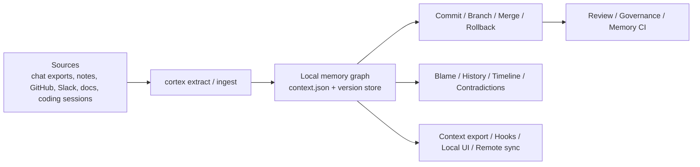

# Cortex

**Own your AI context. Take it everywhere.**

Status:

- self-hosted public beta
- user-owned storage
- stable local `v1` API contract

One command. All your AI context. Every tool.

Cortex lets you extract memory from chat exports, notes, docs, and coding sessions, then carry that context across:

- Claude
- Claude Code
- ChatGPT
- Codex
- Gemini
- Grok
- Windsurf
- Cursor

Some of those tools support direct local instruction files. Some only support copy-paste or import-style surfaces. Cortex handles both honestly: it writes directly where it can, and generates import-ready artifacts where it cannot.

Cortex is still the same local-first memory runtime underneath. The difference is that portability is now the front door instead of buried behind infrastructure vocabulary.

## 30-Second Portability

```bash
pip install "cortex-identity[full]"

# Import once from an export or an existing Cortex graph
cortex portable chatgpt-export.zip --to all --project .
```

That one command will:

- extract a portable `context.json`
- install direct context into local tool files like `CLAUDE.md`, `AGENTS.md`, `GEMINI.md`, `.windsurfrules`, and Cursor rules
- generate import-ready artifacts for chat apps like Claude, ChatGPT, and Grok

Generated targets currently map like this:

- **Direct installs**: Claude Code, Codex, Gemini, Windsurf, Cursor
- **Import-ready artifacts**: Claude, ChatGPT, Grok

See [docs/PORTABILITY.md](docs/PORTABILITY.md) for the exact file paths and outputs.

## Why This Exists

Most AI memory systems make you do the same work over and over again.

You tell ChatGPT your stack. Then Claude forgets it. Then Cursor does not know your current project. Then Codex treats your repository like it has never seen it before.

Cortex exists to stop that repetition while still giving you a serious memory control plane underneath.

When memory matters, you still need answers to questions like:

- Where did that claim come from?
- When was it true?
- What changed between versions?
- Which source introduced the bad memory?
- Can I roll it back without destroying history?
- Who is allowed to write or merge this memory?

Cortex is built to answer those questions directly.

## Beta Status

Cortex is ready for self-hosted beta use by technical teams, not mass-market rollout yet.

The right posture for this release is:

- run it on user-owned storage
- keep verified backups
- prefer scoped API keys and namespace boundaries
- treat prerelease tags as evaluation builds

Beta launch docs:

- [docs/BETA_QUICKSTART.md](docs/BETA_QUICKSTART.md)
- [docs/OPERATIONS.md](docs/OPERATIONS.md)
- [docs/THREAT_MODEL.md](docs/THREAT_MODEL.md)
- [beta feedback template](.github/ISSUE_TEMPLATE/beta_feedback.md)

## What Cortex Does

- Extracts memory from chat exports, notes, plain text, coding sessions, and normalized GitHub, Slack, and docs inputs
- Carries that context across Claude, Claude Code, ChatGPT, Codex, Gemini, Grok, Windsurf, and Cursor
- Stores memory as a local graph you can query, diff, branch, merge, and roll back
- Tracks provenance so you can blame a claim to its source and inspect its receipt trail
- Detects contradictions, semantic drift, timeline changes, and temporal gaps
- Lets you retract memory by source instead of manually cleaning a graph
- Adds governance rules for who can read, write, branch, merge, roll back, push, or pull
- Syncs memory stores explicitly with remote push, pull, and fork semantics
- Exposes a small local web UI for review, blame, history, governance, and remotes
- Exposes local REST, SDK, and MCP tool-server surfaces without taking ownership of user storage

## Who It's For

- Developers who use multiple AI tools and are tired of re-explaining themselves
- Teams that want portable, user-owned context instead of another hosted memory silo
- Builders who need a local memory control plane, not another hosted SaaS
- Power users who want rollback, blame, review, and governance once portability is in place

## Example Use Cases

- **Agent debugging**: explain why an agent believed `Project Atlas` was active, who introduced that claim, and what changed afterward
- **Memory CI**: compare `context.json` on a PR against `main` and fail only on contradictions or temporal gaps
- **Safe experimentation**: branch memory for a new persona, project mode, or imported source before merging it back
- **Bad import recovery**: retract everything that came from one bad export or roll back to a known-good memory state
- **Multi-agent collaboration**: push and pull memory branches between local stores with explicit governance and approval rules
- **Coding assistants with receipts**: export stable project context, inspect history, and keep assistant memory tied to real sources

## Mental Model



## 60-Second Demo

```bash
# One command for the portability pass
cortex portable chatgpt-export.zip --to all --project .

# Inspect the generated portable graph
cortex log
cortex blame portable/context.json --label "Cortex-AI"

# Review or branch memory if you want stricter control
cortex branch import/chatgpt-history
cortex review portable/context.json --against main --fail-on contradictions,temporal_gaps --format md

# Open the local infrastructure console
cortex ui --context-file portable/context.json
```

## Core Workflows

### 1. Build Memory from Real Inputs

```bash
cortex extract notes.json -o context.json
cortex ingest github issue.json -o context.json
cortex ingest slack ./slack-export -o context.json
cortex ingest docs ./docs -o context.json
```

### 2. Version AI Memory Like Code

```bash
cortex commit context.json -m "Import March planning notes"
cortex log
cortex diff <version-a> <version-b>
cortex checkout <version> -o restored.json
cortex rollback context.json --to <version>
```

### 3. Create Safe Branches for Experiments

```bash
cortex branch feature/project-atlas
cortex switch feature/project-atlas
cortex review context.json --against main
cortex merge main
```

### 4. Explain, Audit, and Retract

```bash
cortex blame context.json --label "PostgreSQL"
cortex history context.json --label "PostgreSQL"
cortex claim log --label "PostgreSQL"
cortex memory retract context.json --source planning-doc-v1
```

### 5. Govern and Sync Memory

```bash
cortex governance allow protect-main \
  --actor "agent/*" \
  --action write \
  --namespace main \
  --approval-below-confidence 0.75

cortex remote add origin /path/to/other/store
cortex remote push origin --branch main
cortex remote pull origin --branch main --into-branch remotes/origin/main
```

## Why Cortex Feels Different

Most memory tooling focuses on storage and retrieval.

Cortex focuses on **operability**:

- not just storing memory, but versioning it
- not just retrieving claims, but explaining them
- not just importing data, but retracting bad evidence
- not just sharing context, but governing who can change it
- not just diffing JSON, but surfacing semantic drift and contradiction risk

If Git gives developers confidence in code changes, Cortex is trying to do the same for AI memory changes.

## Local Infrastructure UI

Cortex ships with a small local web app for the operational side of memory:

- review results
- blame receipts
- claim history
- governance policies
- remote sync flows

Run it with:

```bash
cortex ui --context-file context.json
```

## MCP Server

Cortex can also run as a local MCP server over stdio for agent runtimes that want tool-based memory access while
keeping storage user-owned.

```bash
cortex mcp --store-dir .cortex
# or
cortex-mcp --store-dir .cortex --namespace team
```

The MCP surface maps onto the same object/query/version runtime as the REST API, including node, edge, claim,
query, branch, merge, blame, history, indexing, and prune tools.

For self-hosted config, scoped API keys, backups, Docker, and MCP client setup, see
[docs/SELF_HOSTING.md](docs/SELF_HOSTING.md).

## Release and Packaging

Cortex now ships a stable v1 local contract with:

- a committed OpenAPI artifact and compatibility snapshot
- version metadata surfaced across REST, Python, TypeScript, and MCP
- a self-host Docker image and compose flow
- backup/restore and upgrade docs for user-owned stores
- reference Python, TypeScript, and MCP examples
- a lightweight benchmark harness for commit, query, merge preview, and index rebuild

Release operator docs:

- [docs/BETA_QUICKSTART.md](docs/BETA_QUICKSTART.md)
- [docs/SELF_HOSTING.md](docs/SELF_HOSTING.md)
- [docs/OPERATIONS.md](docs/OPERATIONS.md)
- [docs/THREAT_MODEL.md](docs/THREAT_MODEL.md)
- [docs/UPGRADING.md](docs/UPGRADING.md)
- [docs/RELEASE_CHECKLIST.md](docs/RELEASE_CHECKLIST.md)

## Adoption Layer

Cortex now also ships a higher-level `MemorySession` helper for application code that wants to work at the
"agent memory workflow" level instead of stitching raw SDK calls together.

It gives app builders a small set of verbs on top of the stable v1 runtime:

- `remember(...)`
- `search_context(...)`
- `branch_for_task(...)`
- `commit_if_review_passes(...)`

See:

- [docs/AGENT_QUICKSTARTS.md](docs/AGENT_QUICKSTARTS.md)
- [examples/python/self_hosted_client.py](examples/python/self_hosted_client.py)
- [examples/typescript/self_hosted_client.mjs](examples/typescript/self_hosted_client.mjs)

## Memory CI

The repo includes [`.github/workflows/memory-review.yml`](.github/workflows/memory-review.yml), which can:

- compare a checked-in memory file against the base branch
- emit a Markdown review summary in GitHub Actions
- upload JSON and Markdown review artifacts
- fail only on gates you choose, such as `contradictions` and `temporal_gaps`

Local equivalent:

```bash
cortex review context.json --against main --fail-on contradictions,temporal_gaps --format md
cortex review context.json --against main --fail-on none --format json
```

## More Detailed Product Walkthrough

For the full Git-for-AI-Memory feature walkthrough, see [GIT_FOR_AI_MEMORY.md](GIT_FOR_AI_MEMORY.md).

## Install

```bash
pip install cortex-identity
```

Recommended extras:

```bash
pip install "cortex-identity[full]"
```

Other extras:

```bash
pip install "cortex-identity[crypto]"
pip install "cortex-identity[fast]"
```

## Repository Layout

- `cortex/`: CLI, graph model, extraction, review, governance, remotes, UI, identity, and versioning
- `tests/`: CLI and core-library regression suite

## License

MIT
