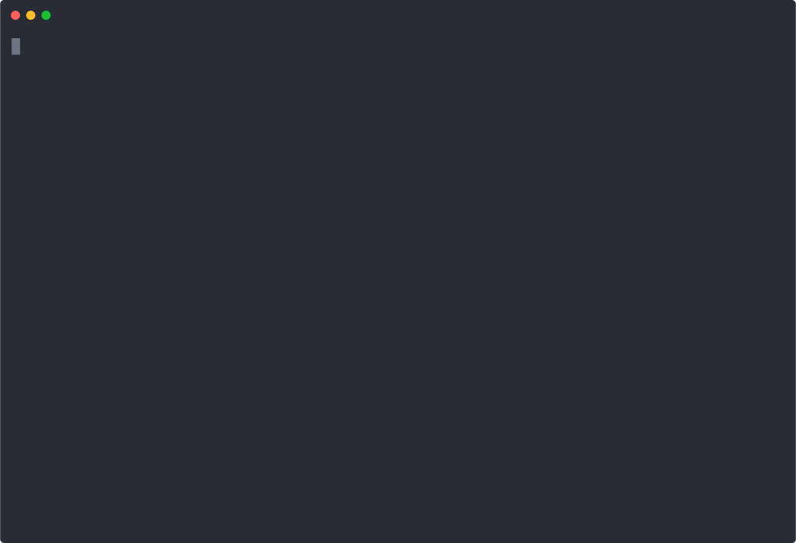

# Cortex Demo Scripts

Run each demo from the repository root:

- `python3.11 demos/demo_retraction.py`
- `python3.11 demos/demo_portability.py`
- `python3.11 demos/demo_audience.py`

Use `--fast` to reduce all delays by 80% for CI, quick previews, or capture rehearsals:

- `python3.11 demos/demo_retraction.py --fast`
- `python3.11 demos/demo_portability.py --fast`
- `python3.11 demos/demo_audience.py --fast`

## Pre-recorded demos

| Demo | ▶ Watch | Cast | SVG | MP4 |
| --- | --- | --- | --- | --- |
| Retraction | [asciinema.org](https://asciinema.org/a/76q9LiYNNainYazH) | [retraction.cast](retraction.cast) |  | [retraction.mp4](retraction.mp4) |
| Portability | [asciinema.org](https://asciinema.org/a/pL0mBuYKYNyfQmcZ) | [portability.cast](portability.cast) |  | [portability.mp4](portability.mp4) |
| Audience | [asciinema.org](https://asciinema.org/a/QX0SDI953AYCYp9S) | [audience.cast](audience.cast) |  | [audience.mp4](audience.mp4) |

Recommended recording workflows:

- `asciinema`: `asciinema rec demos/retraction.cast --command "python3.11 demos/demo_retraction.py"`
- QuickTime: record the terminal window directly on macOS for MP4 or MOV capture.

Recommended GIF conversion:

- `agg` for asciinema casts: `agg demos/retraction.cast demos/retraction.gif`
- `ffmpeg` for QuickTime captures: `ffmpeg -i retraction.mov -vf "fps=12,scale=1280:-1:flags=lanczos" demos/retraction.gif`

These scripts use only the Python 3.11 standard library and automatically strip ANSI color when stdout is not a TTY.
