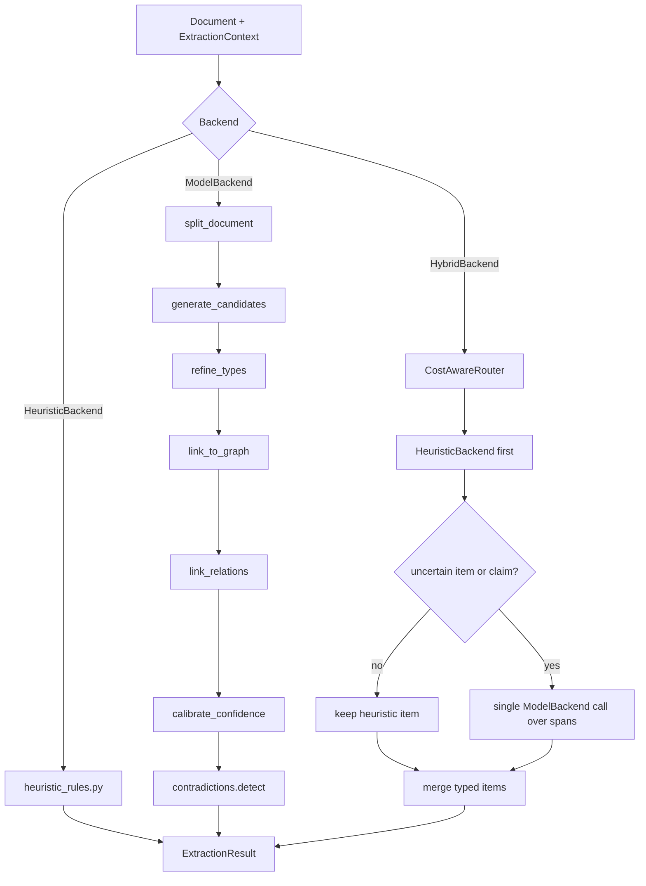

# Extraction

Cortex extraction turns chats, documents, code notes, and transcripts into typed
memory items with provenance, diagnostics, replayable model calls, and a corpus
gate. The public contract is `ExtractionPipeline.run(document, context)`, which
returns an `ExtractionResult` containing:

- `items`: typed `ExtractedFact`, `ExtractedClaim`, and `ExtractedRelationship`
  records.
- `diagnostics`: token counts, cost, latency, stage timings, model and prompt
  version, warnings, cache status, and router decisions.

Supported source loading is cataloged in [INGEST_FORMATS.md](INGEST_FORMATS.md).
The eval-only details also live in [EXTRACTION_EVAL.md](EXTRACTION_EVAL.md).

## Quickstart

Extract from a source file:

```bash
cortex extract run docs/INGEST_FORMATS.md --output /tmp/cortex-ingest.context.json
```

Inspect recent extraction diagnostics:

```bash
cortex debug extractions tail --limit 20
```

Trace one source through extraction stages:

```bash
cortex extract trace docs/INGEST_FORMATS.md \
  --backend heuristic \
  --output /tmp/cortex-extraction-trace.json
```

Replay model extraction offline from the committed corpus replay cache:

```bash
CORTEX_EXTRACTION_REPLAY=read \
CORTEX_EXTRACTION_REPLAY_DIR=tests/extraction/corpus/replay \
cortex extract eval \
  --corpus tests/extraction/corpus \
  --backend model \
  --output /tmp/cortex-extraction-eval.json
```

Evaluate the default corpus gate locally:

```bash
cortex extract eval \
  --corpus tests/extraction/corpus \
  --backend heuristic \
  --output /tmp/cortex-extraction-eval.json
```

## Pipeline Contract

All first-class extraction backends implement the same protocol:

```python
ExtractionPipeline.run(document: Document, context: ExtractionContext) -> ExtractionResult
```

`Document` carries `source_id`, `source_type`, `content`, and `metadata`.
`source_type` is one of `chat`, `doc`, `code`, or `transcript`.

`ExtractionContext` carries:

- `existing_graph`: optional graph used for canonicalization and alias merges.
- `budget`: `max_tokens`, `max_latency_ms`, and `max_cost_usd`.
- `prompt_version`: version tag recorded in diagnostics and replay keys.
- `prompt_overrides`: prompt experiment hooks used by the harness.
- `canonical_resolver`: resolver that can rewrite items to canonical graph IDs.

`ExtractionResult` carries typed items plus `ExtractionDiagnostics`. The legacy
`ExtractionBackend` protocol is kept as a compatibility alias, but new code
should depend on `ExtractionPipeline`.

## Architecture

The model path is a staged pipeline over immutable `PipelineState`. The
heuristic backend implements the same public contract but extracts directly from
`heuristic_rules.py`; the hybrid backend wraps both through the cost router.



### Stage Summary

`split_document` does source-type-aware chunking:

- `chat`: chat turns.
- `doc`: Markdown headings, then paragraphs.
- `code`: symbol-like declarations, then paragraphs.
- `transcript`: timestamped utterances, then paragraphs.

`generate_candidates` calls the candidate extractor per chunk. For the model
backend, this is the schema-constrained Anthropic tool call. Retrieval hints are
included before the call when an embedding backend and existing graph are
available.

`refine_types` runs a second pass for low-confidence facts or claims, using the
typing prompt to disambiguate fact versus claim.

`link_to_graph` canonicalizes items through the configured resolver, the
`CanonicalEntityRegistry`, and retrieval against the existing graph. When an item
resolves to an existing node ID, Cortex writes an alias or merge instead of
creating a duplicate entity.

`link_relations` binds relationship endpoints to canonical labels or IDs and
drops dangling relationships whose endpoints cannot be resolved.

`calibrate_confidence` applies the current bootstrap Platt-style calibration.
The constants are placeholders until the corpus is large enough to learn them.

`contradictions.detect` runs contradiction detection against the existing graph
and records detected contradictions in graph metadata when available.

Each stage records elapsed milliseconds in
`ExtractionDiagnostics.stage_timings`.

## Prompt Library

Prompts live in `cortex/extraction/prompts/` with one Markdown file per stage and
version:

- `candidates.v1.md`
- `typing.v1.md`
- `canonicalize.v1.md`
- `relations.v1.md`

Each prompt starts with YAML front matter:

```yaml
---
version: v1
schema_ref: cortex.extraction.model_backend.typed_extraction_input_schema
inputs:
  - chunk_text
outputs:
  - ExtractedFact
test_fixture: tests/extraction/test_model_backend_schema.py
---
```

Prompt files are loaded by `load_prompt(name, version)` at import time. Missing
versions, malformed front matter, empty prompt bodies, and missing render values
raise loudly. Stage modules keep a `PROMPT_REFERENCES` tuple so tests can verify
that every referenced prompt is present.

Model candidate extraction is constrained by a JSON Schema generated from the
typed output adapter. The Anthropic request uses a tool whose input schema is
that JSON Schema. If validation fails, the backend retries up to two times with
the validation error fed back into the conversation. After the third failure it
returns zero items and records `schema_violation` in diagnostics warnings.

## Diagnostics

Every extraction call appends one JSON object per line to:

```text
.cortex/logs/extractions.jsonl
```

Set `CORTEX_EXTRACTION_LOG_PATH` to override the exact file, or
`CORTEX_STORE_DIR` to move the `.cortex` root.

Diagnostics fields include:

- `tokens_in` and `tokens_out`
- `cost_usd`
- `latency_ms`
- `stage_timings`
- `model`
- `prompt_version`
- `warnings`
- `cache_hit`
- `router_decision`

Tail the log with:

```bash
cortex debug extractions tail --limit 20
```

Use `cortex extract trace <source_file>` when you need intermediate state rather
than a compact diagnostics line. Model traces dump all staged snapshots;
heuristic and hybrid traces dump `split_document` plus the public backend result.

## Replay Cache

The replay cache makes model-backed evals deterministic and offline. It is
keyed by:

```text
sha256(prompt_version + input_content + model_id)
```

Default cache location:

```text
.cortex-cache/extraction-replay/
```

The corpus CI cache is committed under:

```text
tests/extraction/corpus/replay/
```

Environment contract:

| Variable | Values | Meaning |
| --- | --- | --- |
| `CORTEX_EXTRACTION_REPLAY` | `off` | Ignore the replay cache and call the model normally. Default outside CI. |
| `CORTEX_EXTRACTION_REPLAY` | `read` | Read cached model responses. Cache-complete offline evals avoid network calls. Default in CI. |
| `CORTEX_EXTRACTION_REPLAY` | `write` | Call the model and write responses through to the cache. Use only when refreshing goldens. |
| `CORTEX_EXTRACTION_REPLAY_DIR` | path | Override the cache directory. |

On a cache hit, the model backend returns the cached response and sets
`diagnostics.cache_hit=True`. On a miss, the backend falls through to the normal
provider request path; offline CI runs should therefore be cache-complete and
lack provider credentials, so missing replay entries fail visibly instead of
silently refreshing goldens.

## Eval Corpus

The extraction corpus lives in `tests/extraction/corpus/`.

Required files:

- `README.md`: corpus instructions.
- `manifest.yml`: case list.
- One directory per case.
- Each case directory has exactly one `input.md`, `input.json`, or
  `input.jsonl`, plus `gold.json`.

`manifest.yml` entries look like:

```yaml
- id: policy_two_rules
  source_type: doc
  input: input.md
  gold: gold.json
  description: Short policy document with two explicit rules.
```

`gold.json` uses the `extraction-eval-v1` schema:

```json
{
  "schema_version": "extraction-eval-v1",
  "case_id": "policy_two_rules",
  "source_type": "doc",
  "expected_graph": {
    "nodes": [
      {
        "id": "rule:retain-90-days",
        "canonical_id": "rule:retain-90-days",
        "label": "retain records for 90 days",
        "type": "policy",
        "confidence": 0.95
      }
    ],
    "edges": []
  }
}
```

Stable `canonical_id` values matter more than incidental node order. Edges refer
to node canonical IDs. Use source types that match the chunking behavior:
`chat`, `doc`, `code`, or `transcript`.

## Add a Corpus Case

1. Create `tests/extraction/corpus/<case_id>/`.
2. Add exactly one supported input file: `input.md`, `input.json`, or
   `input.jsonl`.
3. Add `gold.json` with the expected graph.
4. Add a matching entry to `tests/extraction/corpus/manifest.yml`.
5. Run the corpus shape test:

```bash
python -m pytest tests/extraction/test_corpus_shape.py -q
```

6. Run the eval gate locally:

```bash
cortex extract eval \
  --corpus tests/extraction/corpus \
  --backend heuristic \
  --output /tmp/cortex-extraction-eval.json
```

For model or hybrid cases, refresh replay files before updating the baseline.

## Rebaseline

Rebaseline only when the corpus, prompt text, schema, metrics, or intended
extractor behavior changes.

Refresh model replay responses:

```bash
CORTEX_EXTRACTION_REPLAY=write \
cortex extract refresh-cache \
  --corpus tests/extraction/corpus \
  --replay-dir tests/extraction/corpus/replay
```

Update the baseline:

```bash
cortex extract eval \
  --corpus tests/extraction/corpus \
  --backend heuristic \
  --output /tmp/cortex-extraction-eval.json \
  --update-baseline
```

Review changes to `tests/extraction/corpus/baseline.json`, any replay files, and
the generated report. A rebaseline PR should explain why the score movement is
expected.

When an eval report includes failures, review them with:

```bash
cortex extract review /tmp/cortex-extraction-eval.json
```

Mark an item as `true_failure` when extraction is wrong, or `gold_is_wrong` when
the corpus label should change. Gold corrections patch the case `gold.json`,
regenerate the baseline, and write a review summary under
`docs/extraction-reviews/`.

## CI Gate

The GitHub Actions `extract-eval` job runs after the test matrix. It reads replay
responses from the committed cache and compares current metrics with
`tests/extraction/corpus/baseline.json`.

The gate fails when any metric regresses by more than the configured tolerance
(`0.01` by default). The report includes:

- node precision, recall, and F1
- relation precision, recall, and F1
- canonicalization accuracy
- contradiction recall
- completeness score
- per-case failures for active learning

The failure taxonomy is:

- `missed_node`
- `wrong_type`
- `bad_canonicalization`
- `hallucinated_node`
- `missed_relation`
- `hallucinated_relation`
- `missed_contradiction`

## Cost Router

`HybridBackend` is implemented by `CostAwareRouter`.

The router:

1. Runs `HeuristicBackend` first under the current `ExtractionBudget`.
2. Keeps high-confidence heuristic items.
3. Escalates every `ExtractedClaim`.
4. Escalates any item with confidence below `0.6`.
5. Sends one model call over only the escalated spans, with known heuristic items
   as context.
6. Merges heuristic and model typed items.

Router diagnostics are recorded under:

```json
{
  "router_decision": {
    "heuristic_kept": 12,
    "escalated": 2,
    "cost_saved_usd": 0.000084
  }
}
```

Use `cortex debug extractions tail --limit 20` to inspect these decisions after
hybrid runs. High-confidence heuristic-only runs should make zero model calls.
